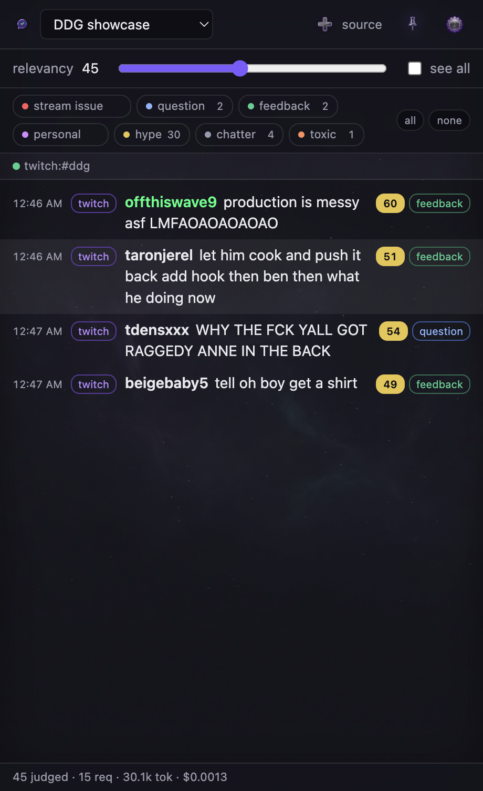
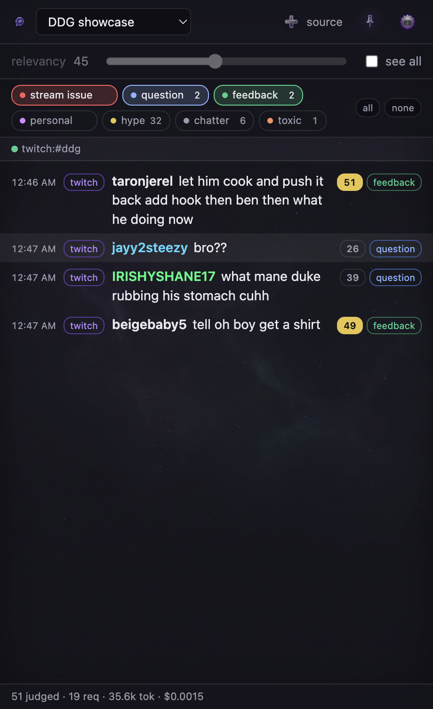
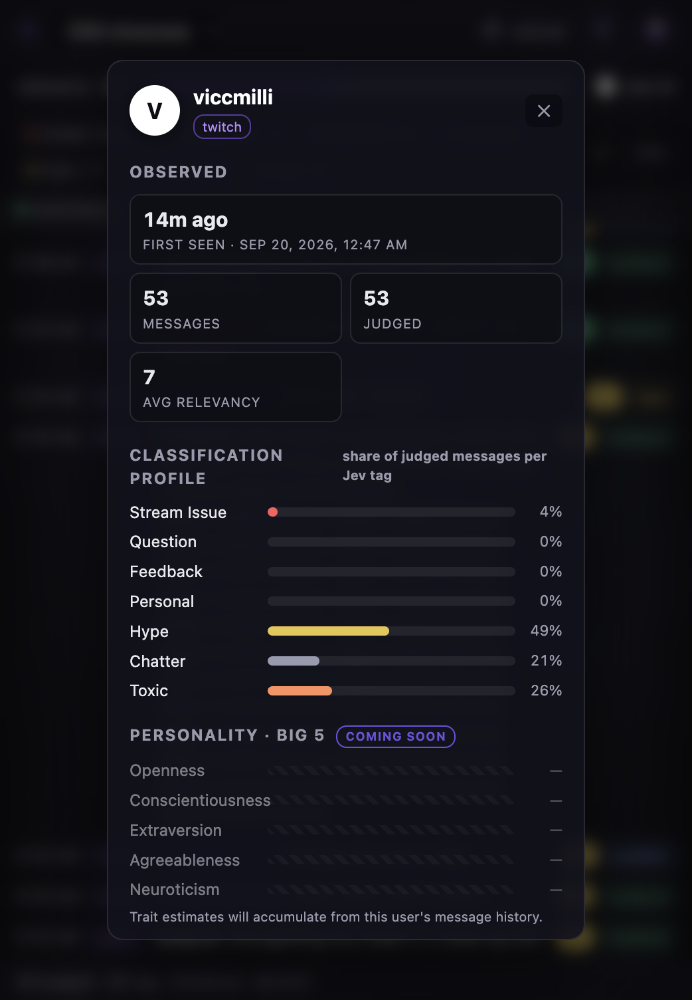
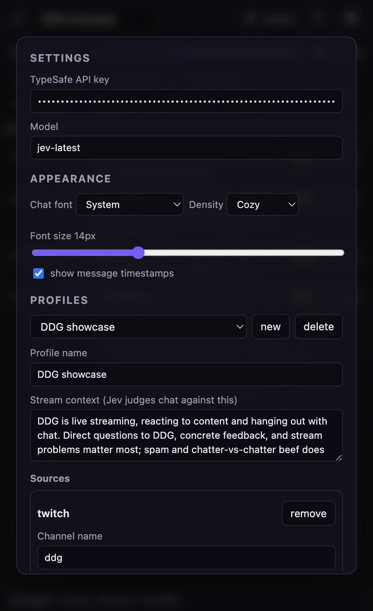

# JevChatHud

A desktop HUD for livestreamers that watches your chat so you don't have to.

JevChatHud ingests live chat from any number of sources — Twitch channels,
Discord channels, YouTube live streams, Facebook live videos — and runs every
message through [TypeSafe](https://typesafe.ai)'s **Jev** model, which returns
a calibrated 0–100 relevancy judgment plus a message-kind classification.
The HUD shows you only what's worth your attention while you perform.

<p align="center">
  
</p>

*Above: a real session against [twitch.tv/ddg](https://twitch.tv/ddg) (≈16,000
viewers live). With the relevancy slider at 45, a firehose of emote spam is cut
down to the four messages actually worth the streamer's glance — each with
Jev's relevancy score and kind tag. The status bar shows the real cost of the
session: 45 messages judged for $0.0013.*

## How it works

- **Profiles** group ingestion sources. A profile might be "Friday variety
  stream" = your Twitch chat + your Discord #stream-chat + a YouTube simulcast.
  Switching profiles closes all running streams and opens the new profile's.
- Each profile carries a **stream context** — a sentence or two about what
  you're doing ("speedrunning Elden Ring; route questions matter, backseating
  doesn't"). Jev judges every message against it.
- Messages are batched (~1s) into a single TypeSafe request using the
  [speculative fan-out](https://docs.typesafe.ai/patterns/fan-out) pattern:
  per message one Score (four attention levels → relevancy 0–100) and one
  Choice (question / stream issue / feedback / personal / hype / chatter / toxic).
- The **relevancy slider** (0–100) filters the feed against Jev's scores in
  realtime — thresholds live in code/UI, not the model, so sliding it never
  re-runs inference. **See all** bypasses curation entirely.
- The **tag bar** filters by message kind instead: click any combination of
  kind chips (each shows a live count) to see only messages Jev tagged with
  one of those kinds at >50% confidence — `all` / `none` bulk-toggle. While
  tags are selected the relevancy slider is ignored, deliberately: kinds like
  *toxic* or *chatter* score near-zero relevancy by design and would otherwise
  never surface for a moderator reviewing them. Clearing all tags returns to
  the relevancy view; clicking a tag while in "see all" drops back to curation.

<p align="center">
  
</p>

*Tag filtering on the same live chat: with `question`, `stream issue`, and
`feedback` checked, only messages Jev classified as one of those kinds remain —
including a 26-relevancy "bro??" question the slider would have hidden.*

## User profiling

Click any username in the feed to open their profile card, built from a
persistent per-user store that survives restarts:

- **Observed** — first-seen timestamp, lifetime message count, how many were
  judged, and average relevancy.
- **Classification profile** — the share of the user's judged messages per Jev
  kind: "how toxic is this user on average" is literally their toxic bar.
- **Personality (Big 5)** and **stylometry** sections are scaffolded for the
  next milestone; the store already retains each user's recent raw messages so
  trait estimation has material from day one.

<p align="center">
  
</p>

*A real chatter from the same session: 53 messages judged, profile 49% hype /
26% toxic / 21% chatter, average relevancy 7 — a glance tells a moderator
everything they need to know.*

## Look & feel

The app runs on a generated deep-space backdrop with translucent, blurred
surfaces (glassmorphism) and image-based toolbar icons — built to look at home
next to OBS on a professional streamer's second monitor. **Settings** opens
from the gear, the File menu, or `Cmd+,`, and closes with `Esc`. The
Appearance section controls the chat font, size, density, and timestamps —
changes apply live. Packaged builds (`npm run dist`) produce a proper
`JevChatHud.app` with its own icon.

<p align="center">
  
</p>

## Running

```sh
npm install
npm start
```

Open settings (⚙), paste your TypeSafe API key, create a profile, add sources,
save, and pick the profile in the top bar.

### Source configuration

| Source | Needs | Notes |
| --- | --- | --- |
| Twitch | channel name only | anonymous IRC, read-only, no OAuth |
| YouTube | Data API key + live video ID | polling; API dictates the interval |
| Discord | bot token + channel IDs | bot must be in the server with the **Message Content** intent enabled |
| Facebook | access token + live video ID | experimental — written to the Graph API docs, not yet exercised live |

## Cost

Jev is priced per input token ($0.042/Mtok as of writing); the status bar
shows a running token/cost counter. A busy chat batches ~8 messages per
request, so even fast chats stay cheap.

## Tests

```sh
npm test
```
