# JevChatHud

A desktop HUD for livestreamers that watches your chat so you don't have to.

JevChatHud ingests live chat from any number of sources — Twitch channels,
Discord channels, YouTube live streams, Facebook live videos — and runs every
message through [TypeSafe](https://typesafe.ai)'s **Jev** model, which returns
a calibrated 0–100 relevancy judgment plus a message-kind classification.
The HUD shows you only what's worth your attention while you perform.

<p align="center">
  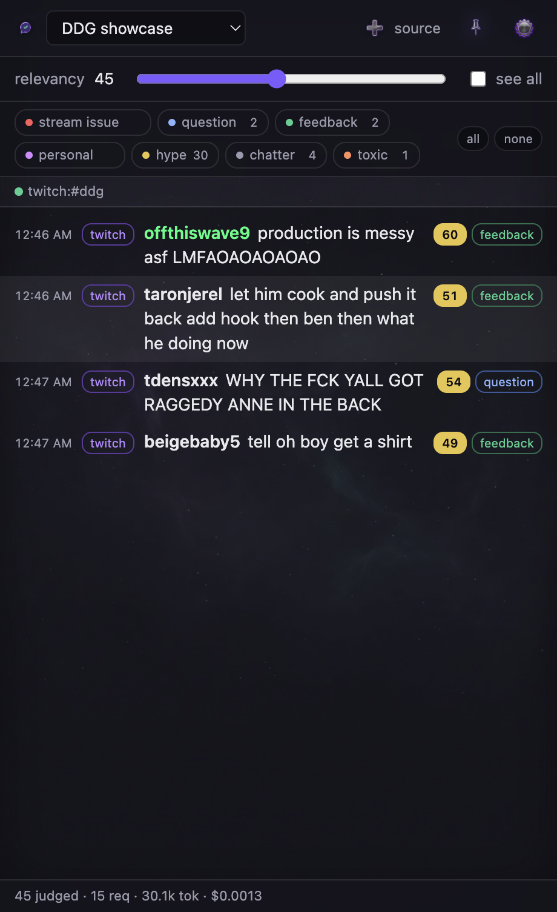
</p>

*Above: a real session against [twitch.tv/ddg](https://twitch.tv/ddg) (≈16,000
viewers live). With the relevancy slider at 45, a firehose of emote spam is cut
down to the four messages actually worth the streamer's glance — each with
Jev's relevancy score and kind tag. The status bar shows the real cost of the
session: 45 messages judged for $0.0013.*

## How it works

- **Profiles** group ingestion sources. A profile might be "Friday variety
  stream" = your Twitch chat + your Discord #stream-chat + a YouTube simulcast.
  Switching profiles closes all running streams and opens the new profile's.
- Each profile carries a **stream context** — a sentence or two about what
  you're doing ("speedrunning Elden Ring; route questions matter, backseating
  doesn't"). Jev judges every message against it.
- Messages are batched (~1s) into a single TypeSafe request using the
  [speculative fan-out](https://docs.typesafe.ai/patterns/fan-out) pattern:
  per message two Scores (four attention levels → relevancy 0–100, and four
  factuality levels → factual 0–100) and one Choice
  (question / stream issue / feedback / personal / hype / chatter / toxic).
- **Two sliders, one verdict.** The **relevancy** slider (0–100) curates on
  attention-worthiness; the **factual** slider curates on Jev's factuality
  score — does the message *assert something verifiable* (a checkable claim
  about the game, the stream, the world) rather than express an opinion,
  reaction, or hype? The factual rubric follows the fact-vs-opinion literature
  ([ClaimBuster](https://arxiv.org/abs/2004.14425)'s non-factual / unimportant
  factual / check-worthy taxonomy): pure opinion → unverifiable speculation →
  personal-experience fact → publicly verifiable claim. It scores
  *checkability, not truth*. The thresholds **AND** together and a slider at 0
  is no constraint — so relevancy-only, factual-only ("facts only"), and
  "on-topic AND verifiable" are all just positions of the two sliders. Both
  dimensions are judged per message in the same request
  ([composite scoring](https://docs.typesafe.ai/patterns/composite-scoring)),
  so sliding either one re-curates every already-judged message instantly —
  thresholds live in code/UI, not the model; no re-inference, no extra cost.
  While both sliders are active, each message's score chip shows the *binding*
  dimension — the score with the least headroom above its slider, prefixed
  `r`/`f` — and the tooltip always carries both.
- **The Jev Judge toggle.** The robed coin in the center of the header is the
  master switch. Eyes open and in color: Jev is filtering your chat ("*Jev,
  now filtering your chat*"). Click him and he closes his eyes, drops to
  greyscale, announces "*Letting all messages through*", and every filter row
  disappears — the raw firehose, nothing hidden, unjudged messages included.
  Judging continues in the background either way, so reopening his eyes
  restores a fully-curated feed instantly. The voicelines are the avatar
  itself speaking ([masky.ai](https://masky.ai) render, played in the coin).
  The coin floats *above* the filter rows — overhanging the header with a
  drop shadow — so he reads as the switch sitting on top of everything he
  controls.
- The **tag bar** filters by message kind instead: click any combination of
  kind chips (each shows a live count) to see only messages Jev tagged with
  one of those kinds at >50% confidence — `all` / `none` bulk-toggle. While
  tags are selected the relevancy slider is ignored, deliberately: kinds like
  *toxic* or *chatter* score near-zero relevancy by design and would otherwise
  never surface for a moderator reviewing them. Clearing all tags returns to
  the slider view.

<p align="center">
  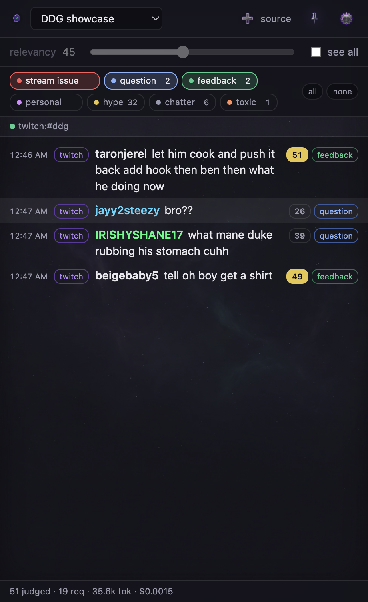
</p>

*Tag filtering on the same live chat: with `question`, `stream issue`, and
`feedback` checked, only messages Jev classified as one of those kinds remain —
including a 26-relevancy "bro??" question the slider would have hidden.*

<p align="center">
  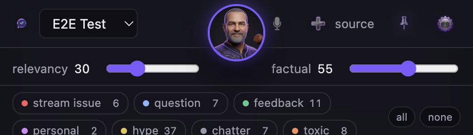
</p>

*The command deck: the Jev Judge coin presiding over the dual sliders and the
tag bar, with the mic toggle at his side.*

<p align="center">
  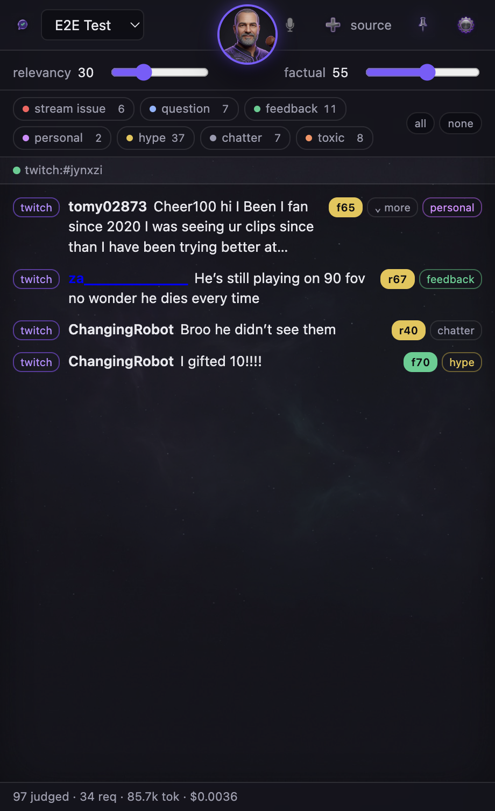
  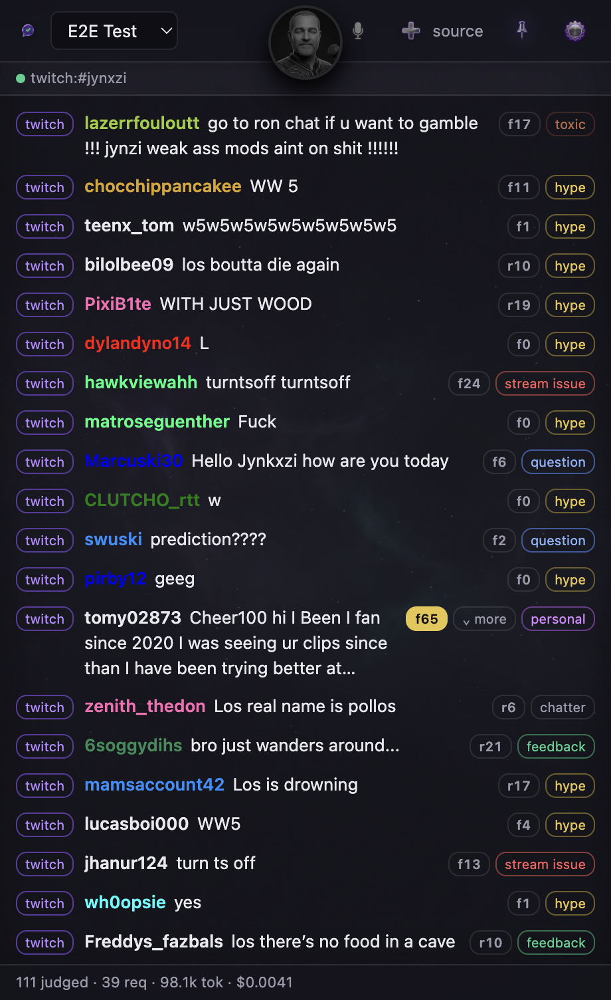
</p>

*Left: both sliders active on a live [twitch.tv/jynxzi](https://twitch.tv/jynxzi)
chat — 97 messages judged, four survived relevancy ≥30 AND factual ≥55, chips
showing the binding dimension (`f70` on "I gifted 10!!!!", a verifiable claim;
`r67` on a FOV critique). Right: the Judge's eyes are closed — greyscale coin,
no filter rows, the raw firehose of `f0` emote spam flowing straight through.*

## Judging against your voice

Chat reacts to what you're *saying*. With the **mic toggle** (🎙 next to the
Judge) lit, the HUD listens to your microphone, transcribes it **locally**
with [whisper.cpp](https://github.com/ggml-org/whisper.cpp) in ~5s chunks, and
hands Jev a rolling last-minute transcript as `streamer_speech` context — so
"relevant" means *relevant to what the streamer is talking about right now*.
A question about the boss you just mentioned outranks one about last week's
stream, and the ~10s broadcast delay chat reacts behind is absorbed by the
60-second window.

- **Nothing leaves the machine**: audio is captured in the renderer, chunked,
  gated for silence, and transcribed by a local `whisper-cli` process. Only
  the resulting text rides along inside the judging request.
- **Settings → Microphone** picks the input device and has a **test mic**
  button: records ~3s with a live level meter, runs it through the exact same
  pipeline, and shows you what Jev heard.
- **See what Jev sees.** Click the **relevancy** label and a strip slides
  open under the sliders — *judged against context:* your profile's stream
  context plus the rolling last-60s transcript, updating live as you speak.
  Click the **factual** label for the matching explainer — what the
  fact-vs-opinion score measures and the four rungs of its 0–100 ladder.
  One strip at a time; the ▴ arrow tucks either away.
- **Guided install, per OS.** The mic needs a local `whisper-cli` binary and
  a ggml model; if either is missing, clicking the mic opens **Settings →
  Microphone**, where a setup card installs both without leaving the app:
  - **Windows / Linux** — one-click download of the official prebuilt
    `whisper-cli` from the [whisper.cpp releases](https://github.com/ggml-org/whisper.cpp/releases)
    (pinned tag, ~10 MB) into the app's data directory.
  - **macOS** — one-click `brew install whisper-cpp` streamed in the UI
    (whisper.cpp publishes no prebuilt mac CLI); if Homebrew itself is
    missing, the card walks you through it.
  - **Model** — pick `base.en` (141 MB, fast — recommended) or `small.en`
    (465 MB, more accurate); downloads with a progress bar to
    `~/.cache/jevchathud/`. Existing installs in `~/.cache/whisper/` and
    other common locations are autodetected.
  - Power users can point at their own build with the **locate…** buttons
    (or `mic.whisperBin` / `mic.whisperModel` in `config.json` — overrides
    always win).

<p align="center">
  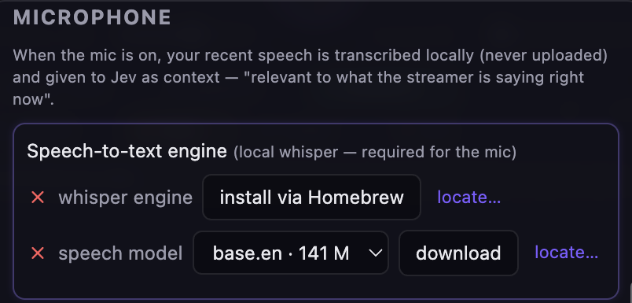
  <br/><em>Nothing installed: the card offers the right install for your OS — prebuilt
  download on Windows/Linux, Homebrew on macOS — and a model picker with sizes.</em>
</p>

<p align="center">
  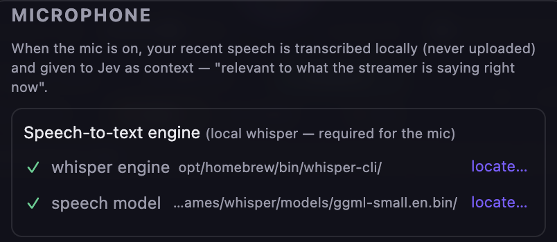
  <br/><em>After the guided install (or on a machine that already has whisper): both
  rows green with the resolved paths.</em>
</p>

<p align="center">
  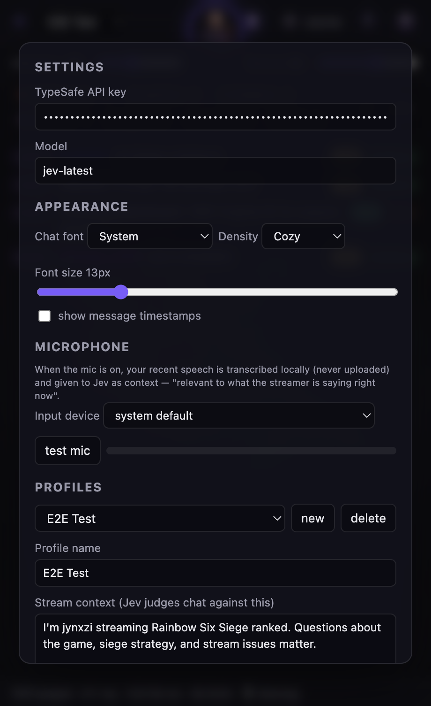
</p>

## Jev reads your chat on stream

Enable **Jev speaks** (Settings → Jev speaks) and once per interval — 1, 5, or
10 minutes — Jev picks the most relevant judged message since the last reading
and *reads it aloud* in a separate always-on-top window built for OBS: fully
transparent and click-through between readings, so nothing shows on screen
until the Judge appears, speaks, and fades away. Toxic-tagged messages are
never read on stream, and an interval with no judged messages is skipped
(nothing rendered, nothing spent).

<p align="center">
  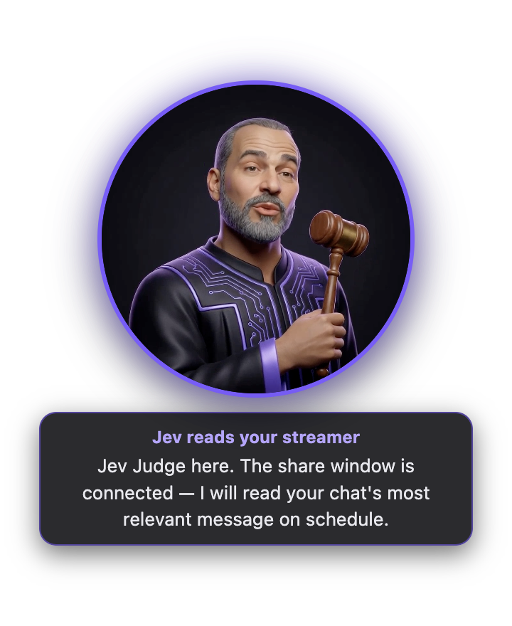
</p>

- **Your Masky account powers it.** Readings are rendered by
  [masky.ai](https://masky.ai) and spend *your* credits — connect with
  **Login with Masky** (opens your browser; the token can be revoked from
  your Masky account anytime) or paste an API token. Once connected, the
  panel shows your Masky identity — avatar, name, and a **logout** button
  that returns you to the connect flow. The default voice is the
  **Jev Judge** avatar on its creator's account; rendering it pays the
  creator through the mask marketplace. Advanced: check *use my own avatar*
  to render one of your own Masky avatars instead.

<p align="center">
  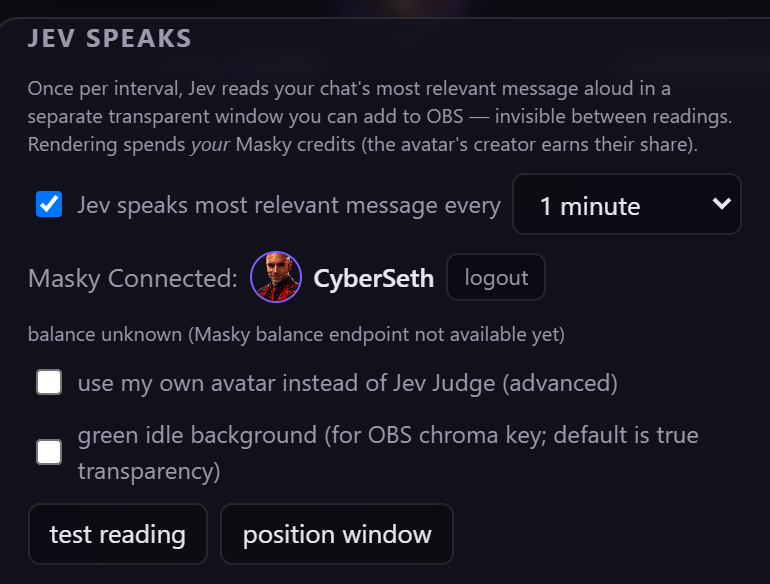
</p>
- **Cost + estimate.** A reading costs ≈0.027 credits per second of speech
  (a typical chat line ≈ 0.05–0.13 credits). The settings panel and status
  bar show your balance as **estimated minutes of Jev talking** remaining,
  and the HUD alerts you if you run out of credits mid-stream.
- **OBS setup.** Add the "Jev Speaks" window as a window capture. True
  transparency works with display capture or compositors that keep alpha;
  for plain window capture check *green idle background* and add a chroma
  key filter.
- **Place and size it.** Click **set location** in settings: the window shows
  a dashed outline you can drag anywhere, with a corner grip to resize (the
  reading scales with the window) and an **✕** that saves the placement. You
  can also just grab the card mid-reading and drag it — the window is only
  clickable while Jev is actually on screen and your cursor is over him, and
  stays click-through the rest of the time.
- **Try it** with the *test reading* button — Jev announces himself so you
  can check placement and audio before going live.

## User profiling

Click any username in the feed to open their profile card, built from a
persistent per-user store that survives restarts:

- **Observed** — first-seen timestamp, lifetime message count, how many were
  judged, and average relevancy.
- **Classification profile** — the share of the user's judged messages per Jev
  kind: "how toxic is this user on average" is literally their toxic bar.
- **Personality (Big 5)** and **stylometry** sections are scaffolded for the
  next milestone; the store already retains each user's recent raw messages so
  trait estimation has material from day one.

<p align="center">
  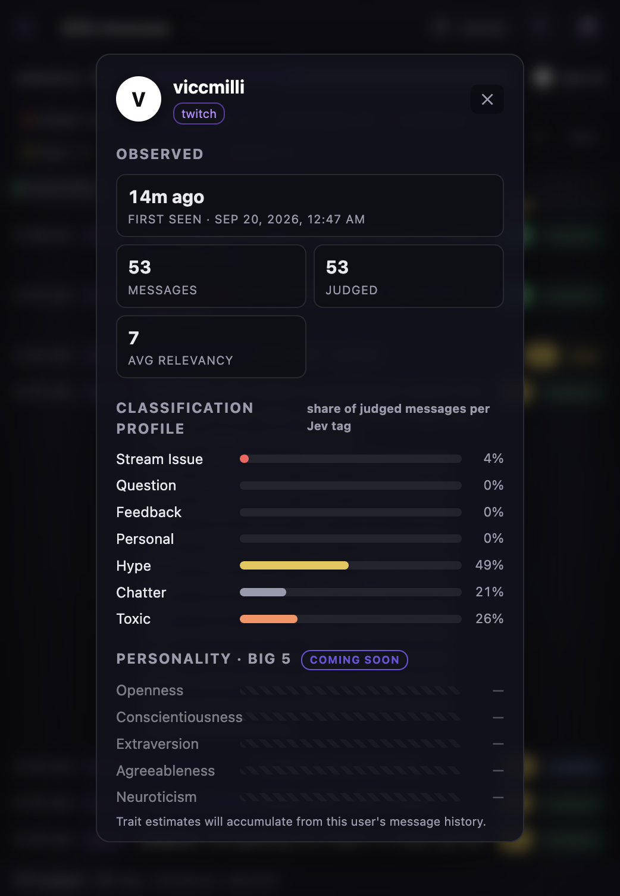
</p>

*A real chatter from the same session: 53 messages judged, profile 49% hype /
26% toxic / 21% chatter, average relevancy 7 — a glance tells a moderator
everything they need to know.*

## Look & feel

The app runs on a generated deep-space backdrop with translucent, blurred
surfaces (glassmorphism) and image-based toolbar icons — built to look at home
next to OBS on a professional streamer's second monitor. **Settings** opens
from the gear, the File menu, or `Cmd+,`, and closes with the ✕ or `Esc` —
there is no save button: every change saves the moment you make it. The panel
has no scrollbar either; scroll with the wheel or just grab an empty spot and
drag. The Appearance section controls the chat font, size, density, and
timestamps — changes apply live. Packaged builds (`npm run dist`) produce a proper
`JevChatHud.app` with its own icon.

<p align="center">
  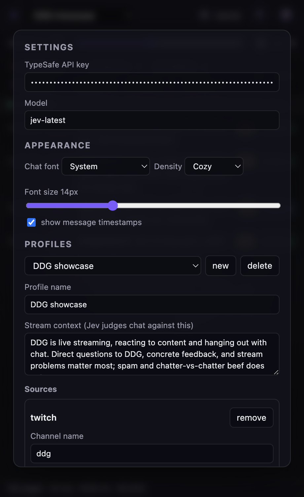
</p>

## Running

```sh
npm install
npm start
```

Open settings (⚙), paste your TypeSafe API key, create a profile, add sources,
save, and pick the profile in the top bar.

### Source configuration

| Source | Needs | Notes |
| --- | --- | --- |
| Twitch | channel name only | anonymous IRC, read-only, no OAuth |
| YouTube | Data API key + live video ID | polling; API dictates the interval |
| Discord | bot token + channel IDs | bot must be in the server with the **Message Content** intent enabled |
| Facebook | access token + live video ID | experimental — written to the Graph API docs, not yet exercised live |

## Cost

Jev is priced per input token ($0.042/Mtok as of writing); the status bar
shows a running token/cost counter. A busy chat batches ~8 messages per
request, so even fast chats stay cheap.

## Tests

```sh
npm test
```
